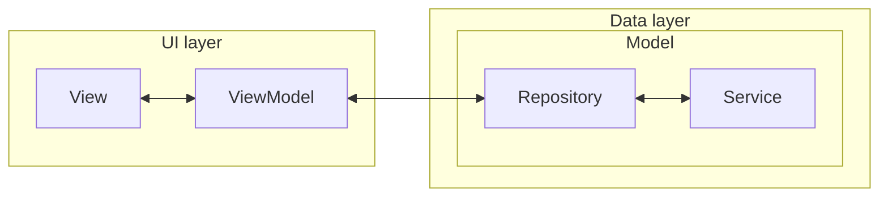
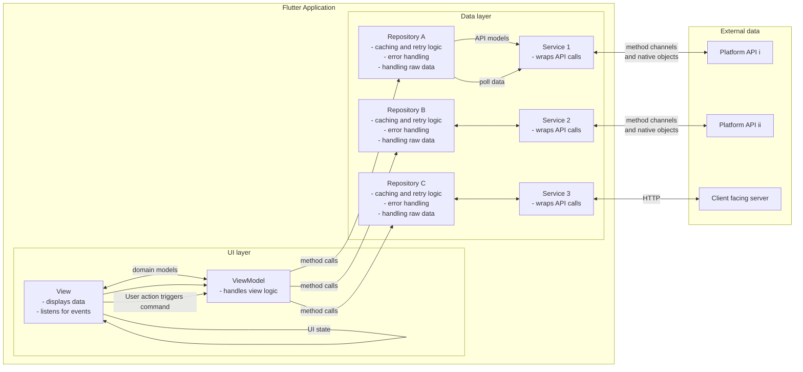
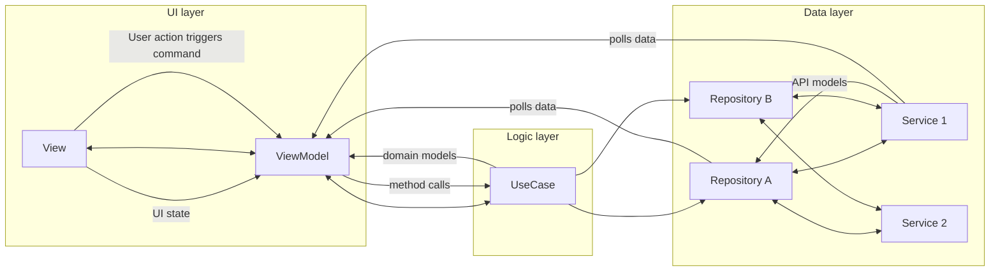
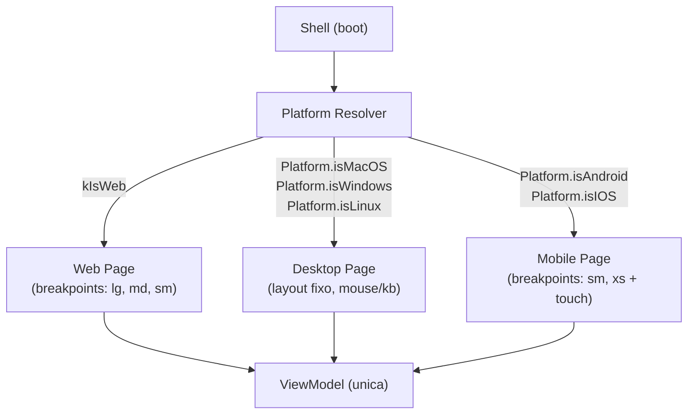
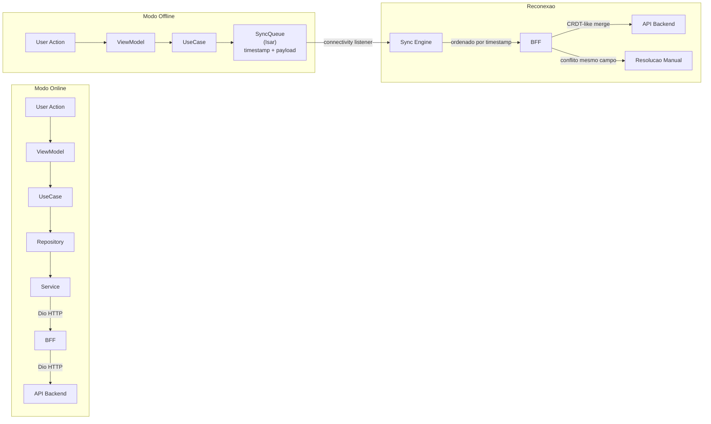
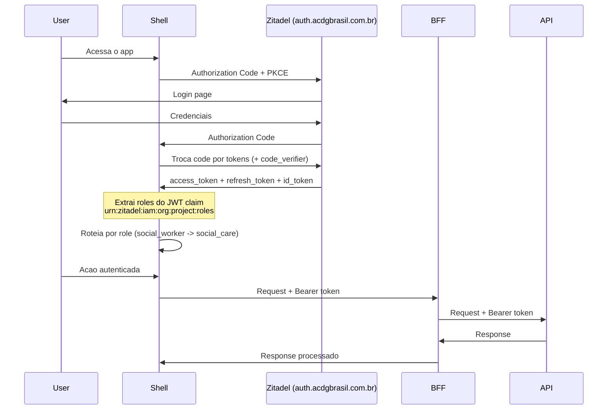
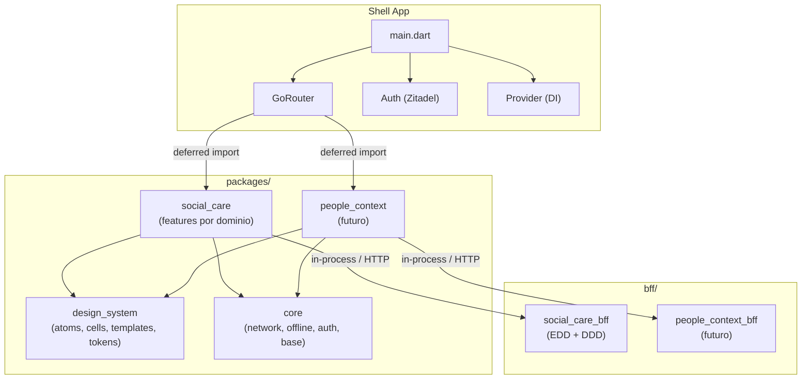
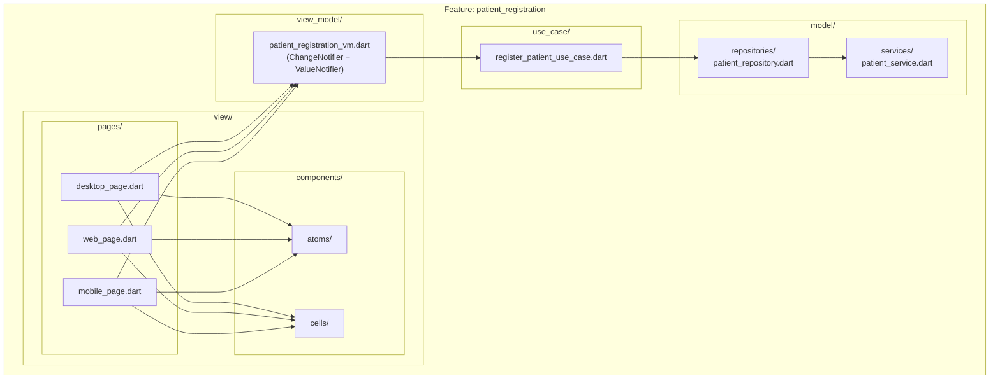

# Diagramas — Frontend ACDG

> Todos os diagramas de arquitetura do ecossistema frontend.

---

## 1. Visao Geral — UI Layer + Data Layer

---

## 2. Arquitetura Completa — Flutter Application + External Data

---

## 3. Arquitetura com Logic Layer (UseCase)

---

## 4. Adaptive Design — Resolucao de Plataforma

---

## 5. Offline First — Queue de Sincronizacao

---

## 6. Autenticacao — Zitadel OIDC PKCE

---

## 7. Micro-Frontend — Composicao de Packages

---

## 8. Feature Interna — Estrutura MVVM

