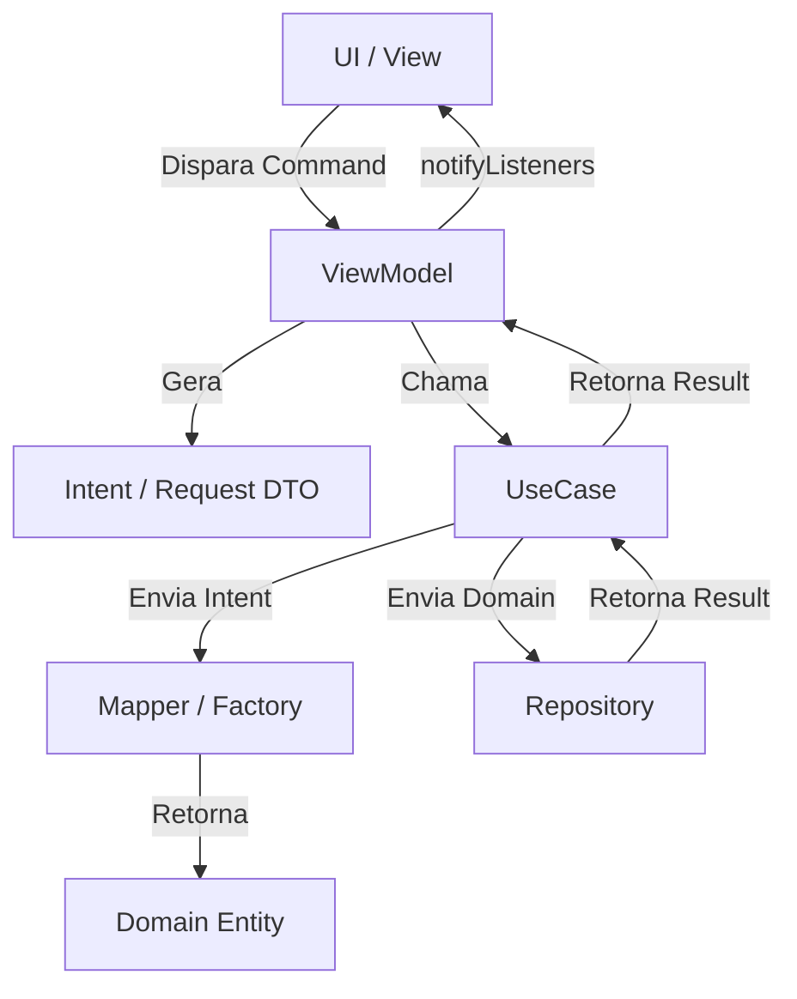

# Architectural Gold Standard — Frontend ACDG

Este documento consolida as decisões de engenharia e padrões de excelência estabelecidos durante a refatoração do ecossistema ACDG. Estes padrões devem ser seguidos rigorosamente em todos os novos módulos para garantir previsibilidade, testabilidade e escalabilidade.

---

## Diagrama de Fluxo Arquitetural (MVVM + Clean Architecture)



---

## 1. Gestão de Ambiente (O Padrão Env)
* **Fonte de Verdade:** `secrets/env/env.yaml`. Centraliza todas as chaves por ambiente usando âncoras YAML.
* **Automação:** Sempre usar o script `dart scripts/generate_env.dart <env>` para gerar o `.env` de compilação.
* **Injeção Segura:** As variáveis são capturadas no `main.dart` via `const String.fromEnvironment` e injetadas no `package:core/Env` via `Env.configure()`.
* **Fail-Fast:** O método `Env.validate()` deve ser chamado no boot para impedir que o app inicie sem configurações obrigatórias.

**Código Ruim (Acoplamento e Insegurança):**
```dart
// Lendo direto do ambiente na camada de UI ou Repositório
final apiUrl = const String.fromEnvironment('API_URL', defaultValue: 'https://dev.api.com');
```

**Código Bom (Centralizado e Validado):**
```dart
// No main.dart
Env.configure(apiUrl: const String.fromEnvironment('API_URL'));
Env.validate(); // Quebra o app imediatamente se faltar algo vital

// No Repositório
final url = Env.apiUrl;
```

---

## 2. Padrões de Comunicação (Intent vs Command)
Existe uma separação estrita entre ações executáveis da interface e pacotes de dados que viajam para o domínio.

* **Intent / Request (DTO):** Objetos que transportam os dados capturados da UI para a Lógica. São snapshots imutáveis de dados brutos. **Nunca** chame-os de `Command`.
* **Command Pattern:** O termo `Command` (ex: `Command0`, `Command1`) é estritamente reservado para o encapsulamento de ações de UI no ViewModel que gerenciam nativamente estados de `running`, `error` e `completed`.

**Código Ruim (Conflito de Nomenclatura):**
```dart
// DTO chamado de Command gerando confusão
final class RegisterPatientCommand { ... }

// ViewModel misturando o padrão Command com o DTO "Command"
class PatientViewModel extends ChangeNotifier {
  late final Command0 registerAction;
  
  Future<Result> _onRegister() async {
    final payload = RegisterPatientCommand(...);
    return useCase.execute(payload);
  }
}
```

**Código Bom (Nomenclatura Clara):**
```dart
// DTO claramente identificado
final class RegisterPatientIntent { ... }

class PatientViewModel extends ChangeNotifier {
  late final Command0 register; // O Command encapsula a ação
  
  Future<Result> _onRegister() async {
    final intent = RegisterPatientIntent(...);
    return useCase.execute(intent);
  }
}
```

---

## 3. Gerenciamento de Estado UI (MVVM Swift-like)
* **Reatividade Única:** O ViewModel (ChangeNotifier) deve ser a única fonte de verdade para a View. 
* **Anti-Pattern de ValueNotifier:** Não utilize `ValueNotifier` dentro de classes que já herdam de `ChangeNotifier` ou `BaseViewModel`. Isso cria reatividade redundante e força a UI a gerenciar múltiplos `ListenableBuilders`.

**Código Ruim (Reatividade Redundante):**
```dart
class PatientViewModel extends BaseViewModel { // BaseViewModel já é um ChangeNotifier
  final ValueNotifier<RegistrationFormData> form = ValueNotifier(const RegistrationFormData());
  final ValueNotifier<List<LookupItem>> relationships = ValueNotifier([]);

  void updateName(String name) {
    // Aloca novos objetos e requer ValueListenableBuilder na UI
    form.value = form.value.copyWith(firstName: name); 
  }
}
```

**Código Bom (Estado Centralizado):**
```dart
class PatientViewModel extends BaseViewModel {
  RegistrationFormData _form = const RegistrationFormData();
  RegistrationFormData get form => _form;

  List<LookupItem> _relationships = const [];
  List<LookupItem> get relationships => _relationships;

  void updateForm(RegistrationFormData Function(RegistrationFormData) update) {
    _form = update(_form);
    notifyListeners(); // Uma única fonte de reatividade
  }
}
```

---

## 4. Validação com Value Objects e Máscaras (Formz "Na Mão")
Campos de formulário não devem ser strings puras validadas na UI. A UI deve ser "burra". Regras de negócio, cálculos matemáticos (como CPF) e formatação lógica devem viver no domínio/apresentação (Value Objects), usando o padrão `formz`.

### O Exemplo Definitivo: Validação e Máscara de CPF sem Libs Externas

**Passo A: O Formatador Visual (UI - `TextInputFormatter`)**
Intercepta a digitação apenas para formatar visualmente.
```dart
import 'package:flutter/services.dart';

class CpfInputFormatter extends TextInputFormatter {
  @override
  TextEditingValue formatEditUpdate(TextEditingValue oldValue, TextEditingValue newValue) {
    final digitsOnly = newValue.text.replaceAll(RegExp(r'[^\d]'), '');
    if (digitsOnly.length > 11) return oldValue;

    final buffer = StringBuffer();
    int selectionIndex = newValue.selection.end;

    for (int i = 0; i < digitsOnly.length; i++) {
      if (i == 3 || i == 6) {
        buffer.write('.');
        if (i <= selectionIndex && newValue.text.length > oldValue.text.length) selectionIndex++;
      } else if (i == 9) {
        buffer.write('-');
        if (i <= selectionIndex && newValue.text.length > oldValue.text.length) selectionIndex++;
      }
      buffer.write(digitsOnly[i]);
    }

    final formattedString = buffer.toString();
    if (selectionIndex > formattedString.length) selectionIndex = formattedString.length;

    return TextEditingValue(
      text: formattedString,
      selection: TextSelection.collapsed(offset: selectionIndex),
    );
  }
}
```

**Passo B: O Value Object (ViewModel - `FormzInput`)**
Executa a matemática real do negócio e mantém o estado de erro.
```dart
import 'package:formz/formz.dart';

enum CpfValidationError { empty, invalidFormat }

class CpfInput extends FormzInput<String, CpfValidationError> {
  const CpfInput.pure() : super.pure('');
  const CpfInput.dirty([super.value = '']) : super.dirty();

  @override
  CpfValidationError? validator(String value) {
    if (value.trim().isEmpty) return CpfValidationError.empty;
    final numbers = value.replaceAll(RegExp(r'[^0-9]'), '');
    if (!_isValidCpfLogic(numbers)) return CpfValidationError.invalidFormat;
    return null;
  }

  bool _isValidCpfLogic(String cpf) {
    if (cpf.length != 11) return false;
    if (RegExp(r'^(\d)\1*$').hasMatch(cpf)) return false; // Bloqueia 111.111.111-11

    List<int> numbers = cpf.split('').map(int.parse).toList();

    int sum1 = 0;
    for (int i = 0; i < 9; i++) sum1 += numbers[i] * (10 - i);
    int digit1 = (sum1 * 10) % 11;
    if (digit1 == 10) digit1 = 0;
    if (digit1 != numbers[9]) return false;

    int sum2 = 0;
    for (int i = 0; i < 10; i++) sum2 += numbers[i] * (11 - i);
    int digit2 = (sum2 * 10) % 11;
    if (digit2 == 10) digit2 = 0;
    if (digit2 != numbers[10]) return false;

    return true;
  }
}
```

**Passo C: A Implementação na UI**

**Código Ruim (Lógica na UI e Strings Soltas):**
```dart
TextFormField(
  validator: (value) {
    // UI tomando decisões de negócio
    if (value == null || value.isEmpty) return 'CPF obrigatório';
    if (value.length < 14) return 'CPF inválido';
    return null;
  },
  onSaved: (value) => cpfText = value,
)
```

**Código Bom (UI Burra, orientada ao ViewModel):**
```dart
final _cpfFormatter = CpfInputFormatter();

// ...
TextFormField(
  initialValue: viewModel.form.cpf.value,
  inputFormatters: [_cpfFormatter], // UI trata apenas o visual
  onChanged: (v) => viewModel.updateForm((s) => s.copyWith(cpf: CpfInput.dirty(v))), // Envia para o VM
  decoration: InputDecoration(
    labelText: 'CPF *',
    // O erro é derivado exclusivamente do estado do Formz
    errorText: switch (viewModel.form.cpf.error) {
      CpfValidationError.empty => 'O CPF é obrigatório',
      CpfValidationError.invalidFormat => 'CPF inválido',
      null => null,
    },
  ),
)
```

---

## 5. Tratamento de Erros (Sealed Classes e Pattern Matching)
Retornos de falhas não devem ser genéricos. A camada de domínio deve exportar `sealed classes` de erros, obrigando a UI a tratar exaustivamente cada cenário via `switch`.

**Código Ruim (Catch genérico na UI):**
```dart
// A UI não sabe exatamente o que deu errado
final error = viewModel.register.error;
Text(error.toString()); // Pode cuspir um "Exception: PAT-409" feio para o usuário
```

**Código Bom (Tratamento Exaustivo com Sealed Classes):**
```dart
// No Domínio:
sealed class RegistrationError implements Exception {}
final class DuplicatePatientError extends RegistrationError {}
final class NetworkRegistrationError extends RegistrationError {}

// Na UI:
final result = viewModel.register.result;
final message = switch (result) {
  Failure(:final error) when error is DuplicatePatientError => 'Este paciente já existe no sistema.',
  Failure(:final error) when error is NetworkRegistrationError => 'Verifique sua conexão.',
  Failure() => 'Erro inesperado. Tente novamente.', // Fallback
  _ => '',
};

Text(message);
```

---

## 6. Mappers e Factories (Isolando a Orquestração)
O `UseCase` deve ser estritamente um orquestrador. Ele não deve construir objetos complexos do domínio, formatar datas ou gerar UUIDs. 

**Código Ruim (UseCase sobrecarregado atuando como Factory):**
```dart
class RegisterPatientUseCase extends BaseUseCase<RegisterPatientIntent, PatientId> {
  Future<Result> execute(RegisterPatientIntent intent) async {
    // UseCase poluído com conversões
    final birthTimeStamp = TimeStamp.fromDate(intent.birthDate);
    final id = PatientId.create(UuidUtil.generateV4());
    
    final patient = Patient.create(id: id, birthDate: birthTimeStamp, ...);
    return repository.registerPatient(patient);
  }
}
```

**Código Bom (Responsabilidades Separadas):**
```dart
class RegisterPatientUseCase extends BaseUseCase<RegisterPatientIntent, PatientId> {
  Future<Result> execute(RegisterPatientIntent intent) async {
    // 1. Domain Assembly isolado no Mapper
    final patientRes = PatientRegistrationMapper.toDomain(intent);
    if (patientRes is Failure) return Failure(patientRes.error);
    
    // 2. Orquestração Pura
    return repository.registerPatient((patientRes as Success).value);
  }
}
```

---

## 7. Dart Moderno (Higiene de Coleções)
Evite instanciar listas mutáveis ou usar loops imperativos sempre que o SDK do Dart fornecer uma alternativa funcional.

**Código Ruim (Alocação desnecessária e loops imperativos):**
```dart
// Aloca memória atoa para uma lista inicial
List<LookupItem> _relationships = []; 

// Loop manual para limpar nulos
List<String> validNames = [];
for(var name in names) {
  if (name != null) validNames.add(name);
}
```

**Código Bom (Otimizado e Funcional):**
```dart
// const [] não aloca memória na heap
List<LookupItem> _relationships = const []; 

// Funcional e idiomático no Dart 3+
final validNames = names.nonNulls.toList();
final firstValid = names.firstWhereOrNull((n) => n.startsWith('A'));
```
## 8. Responsábilidade de geração de informações:
**UUID:** Geração de IDs é responsabilidade de infraestrutura. Use `UuidUtil` do `package:core`.