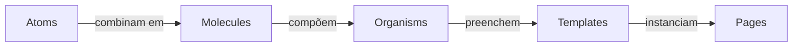
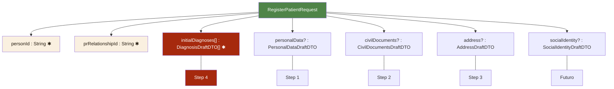
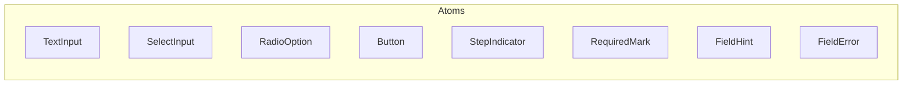
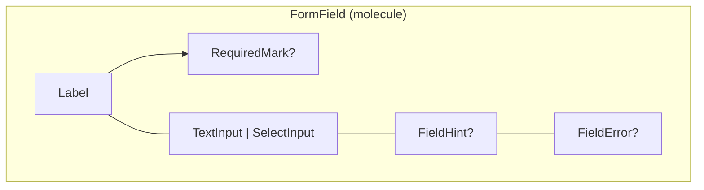
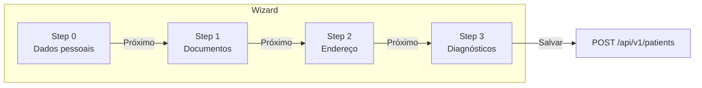
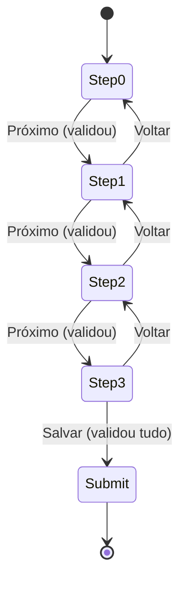

# CONECTA RAROS — Documentação de Componentes

> **Formulário de cadastro — Pessoa de Referência**
> Atomic Design + API Contract | Março 2026

---

## Sumário

1. [Visão geral](#1-visão-geral)
2. [Design tokens](#2-design-tokens)
3. [Atoms](#3-atoms-elementos-primitivos)
4. [Molecules](#4-molecules-combinações-funcionais)
5. [Organisms](#5-organisms-seções-completas)
6. [Template](#6-template-estrutura-do-wizard)
7. [Validação](#7-regras-de-validação-por-step)
8. [Responsividade](#8-responsividade)
9. [Árvore de componentes](#9-árvore-de-componentes)

---

## 1. Visão geral

Este documento descreve a arquitetura completa de componentes para o formulário de cadastro de **Pessoa de Referência** do sistema Conecta Raros, seguindo a metodologia **Atomic Design**. Cada componente é especificado com suas props, variantes, regras de validação e mapeamento direto com o contrato da API.

### 1.1 O que é Atomic Design?

Atomic Design é uma metodologia criada por Brad Frost que organiza componentes de interface em cinco níveis de complexidade crescente:



| Nível | Definição | Exemplo neste projeto |
|---|---|---|
| **Atoms** | Elementos indivisíveis | `TextInput`, `Button`, `RadioOption` |
| **Molecules** | Combinação de 2-3 atoms com função unitária | `FormField` = Label + Input + Hint |
| **Organisms** | Seções completas compostas por molecules | `StepPersonalData` (um step inteiro) |
| **Templates** | Estrutura de layout sem dados reais | `RegistrationWizard` (wizard skeleton) |
| **Pages** | Template preenchido com dados e lógica | Tela de cadastro final |

Neste documento, focamos nos níveis **Atom até Organism**, que são os que o desenvolvedor precisa implementar.

### 1.2 Contrato da API

```
POST /api/v1/patients
Header obrigatório: X-Actor-Id (extraído automaticamente da sessão)
Role necessária: social_worker
```

O payload é composto por 3 campos obrigatórios no nível raiz e 4 objetos opcionais. Cada step do wizard mapeia diretamente para um ou mais desses objetos.



| Campo | Tipo | Obrigatório | Step |
|---|---|---|---|
| `personId` | `String` | ✅ Sim | Gerado auto |
| `prRelationshipId` | `String` | ✅ Sim | Gerado auto |
| `initialDiagnoses[]` | `DiagnosisDraftDTO[]` | ✅ Sim | Step 4 |
| `personalData` | `PersonalDataDraftDTO` | Não | Step 1 |
| `civilDocuments` | `CivilDocumentsDraftDTO` | Não | Step 2 |
| `address` | `AddressDraftDTO` | Não | Step 3 |
| `socialIdentity` | `SocialIdentityDraftDTO` | Não | Futuro |

---

## 2. Design tokens

Valores centralizados como variáveis CSS ou constantes do tema.

### 2.1 Cores

| Token | Hex | Uso |
|---|---|---|
| `--color-bg` | `#F2E2C4` | Fundo da aplicação |
| `--color-bg-card` | `#FAF0E0` | Cards e containers |
| `--color-bg-white` | `#FFFBF4` | Texto sobre verde/vermelho |
| `--color-brown` | `#261D11` | Texto principal, borders ativos |
| `--color-brown-50` | `rgba(38,29,17,0.5)` | Placeholders, texto secundário |
| `--color-brown-20` | `rgba(38,29,17,0.2)` | Borders inativos, linhas |
| `--color-brown-10` | `rgba(38,29,17,0.1)` | Divisores, hover sutil |
| `--color-green` | `#4F8448` | Ações primárias, sucesso |
| `--color-green-light` | `#6BA362` | Hover de botão primário |
| `--color-red` | `#A6290D` | Erro, ação destrutiva |
| `--color-red-light` | `#C4441F` | Hover de botão danger |

### 2.2 Tipografia

| Token | Família | Uso |
|---|---|---|
| `--font-heading` | `Satoshi, system-ui, sans-serif` | Títulos, labels, stepper, botões nav |
| `--font-body` | `Erode, Georgia, serif` | Inputs, placeholders, botões CTA, hints |

**Escala tipográfica:**

| Elemento | Família | Peso | Tamanho | Estilo |
|---|---|---|---|---|
| Page title (h1) | Satoshi | 700 | 64px | Normal |
| Section title | Satoshi | 700 | 14px uppercase | `letter-spacing: 2px` |
| Field label | Satoshi | 700 | 18px | Normal |
| Input value | Erode | 300 | 16px | Italic |
| Placeholder | Erode | 300 | 16px | Italic, `opacity: 0.5` |
| Hint text | Erode | 300 | 12px | Italic, `opacity: 0.5` |
| Error text | Satoshi | 400 | 12px | Normal, cor `--color-red` |
| Button (CTA) | Erode | 500 | 16px | Italic |
| Stepper label | Satoshi | 500 | 13px | Normal |

### 2.3 Espaçamento

| Token | Valor | Uso |
|---|---|---|
| `--spacing-page` | `48px` | Padding lateral da página |
| `--spacing-section` | `32px` | Gap entre seções |
| `--spacing-field` | `28px vertical / 40px horizontal` | Gap entre campos no grid |
| `--spacing-inner` | `8px` | Padding interno de inputs |
| `--radius-pill` | `100px` | Botões arredondados |
| `--radius-card` | `12px` | Cards de diagnóstico |

---

## 3. Atoms (elementos primitivos)

Atoms são os blocos mais básicos da interface. **Não possuem lógica de negócio** — apenas recebem props e renderizam.



### 3.1 `TextInput`

Campo de texto com underline. É o atom mais utilizado no formulário.

**Props:**

| Prop | Tipo | Default | Descrição |
|---|---|---|---|
| `value` | `string` | `""` | Valor controlado |
| `placeholder` | `string` | `""` | Texto exibido quando vazio |
| `onChange` | `(value: string) => void` | — | Callback de mudança |
| `disabled` | `boolean` | `false` | Desabilita o campo |
| `maxLength` | `number?` | `undefined` | Limite de caracteres |
| `mask` | `"cpf" \| "cep" \| "phone" \| "nis" \| null` | `null` | Máscara automática |
| `type` | `"text" \| "date"` | `"text"` | Tipo do input HTML |

**Estados visuais:**

```mermaid
stateDiagram-v2
    [*] --> Default
    Default --> Focused : onFocus
    Focused --> Default : onBlur
    Focused --> Valid : validação ok
    Focused --> Error : validação falhou
    Valid --> Focused : onFocus
    Error --> Focused : onFocus
    Default --> Disabled : prop disabled=true
```

| Estado | Estilo |
|---|---|
| Default | `border-bottom: 1.5px solid var(--color-brown-20)` |
| Focused | `border-bottom: 1.5px solid var(--color-brown)` |
| Valid | `border-bottom: 1.5px solid var(--color-green)` |
| Error | `border-bottom: 1.5px solid var(--color-red)` |
| Disabled | `opacity: 0.4; pointer-events: none` |

**Lógica de máscara:**

| Máscara | Formato | Regex | Regra |
|---|---|---|---|
| `cpf` | `000.000.000-00` | `/\D/g` | Insere `.` nas posições 3, 7 e `-` na 11 |
| `cep` | `00000-000` | `/\D/g` | Insere `-` na posição 5 |
| `phone` | `(00) 00000-0000` | `/\D/g` | Insere `(`, `)` e `-` conforme posição |
| `nis` | `00000000000` | `/\D/g` | Apenas números, `maxLength: 11` |

---

### 3.2 `SelectInput`

Dropdown nativo estilizado com chevron customizado. Usado para UF, Cidade, Nacionalidade.

**Props:**

| Prop | Tipo | Default | Descrição |
|---|---|---|---|
| `value` | `string` | `""` | Valor selecionado |
| `options` | `{ value: string; label: string }[]` | `[]` | Opções disponíveis |
| `placeholder` | `string` | `"Selecione"` | Texto do option disabled |
| `onChange` | `(value: string) => void` | — | Callback |

> O select usa `appearance: none` e um SVG inline como `background-image` para o chevron. Posição: `background-position: right 4px center`.

---

### 3.3 `RadioOption`

Botão de rádio individual com círculo customizado.

**Props:**

| Prop | Tipo | Default | Descrição |
|---|---|---|---|
| `label` | `string` | — | Texto ao lado do rádio |
| `checked` | `boolean` | `false` | Se está selecionado |
| `name` | `string` | — | Agrupa rádios no mesmo grupo |
| `value` | `string` | — | Valor emitido |
| `onChange` | `(value: string) => void` | — | Callback |

> **Visual:** círculo 20px, `border: 1.5px solid --color-brown`. Quando `checked`: background `--color-brown` + círculo interno 6px `--color-bg`.

---

### 3.4 `Button`

Botão com ícone opcional. Sempre `border-radius: 100px` (pill shape).

**Variantes:**

| Variante | Background | Cor texto | Border | Uso |
|---|---|---|---|---|
| `primary` | `--color-green` | `--color-bg-white` | none | Próximo, Salvar |
| `secondary` | `transparent` | `--color-brown` | `1.5px solid --color-brown-20` | Voltar |
| `danger` | `--color-red` | `--color-bg-white` | none | Limpar |

**Props:**

| Prop | Tipo | Default | Descrição |
|---|---|---|---|
| `variant` | `"primary" \| "secondary" \| "danger"` | `"primary"` | Estilo visual |
| `children` | `ReactNode` | — | Conteúdo (texto + ícone) |
| `onClick` | `() => void` | — | Callback |
| `disabled` | `boolean` | `false` | Desabilita (`opacity: 0.4`) |
| `icon` | `"arrow-right" \| "arrow-left" \| "check" \| "x" \| "plus"` | `undefined` | Ícone SVG |
| `iconPosition` | `"left" \| "right"` | `"right"` | Posição do ícone |

---

### 3.5 `StepIndicator`

Círculo numerado do stepper. Muda de aparência conforme o estado.

**Props:**

| Prop | Tipo | Descrição |
|---|---|---|
| `number` | `number` | Número exibido |
| `state` | `"pending" \| "active" \| "completed"` | Estado visual |

**Estados:**

| Estado | Background | Cor nº | Border |
|---|---|---|---|
| `pending` | `transparent` | `--color-brown-50` | `2px solid --color-brown-20` |
| `active` | `--color-brown` | `--color-bg` | `2px solid --color-brown` |
| `completed` | `--color-green` | `--color-bg-white` (ícone ✓) | `2px solid --color-green` |

---

### 3.6 `RequiredMark`

Asterisco vermelho: `<span>` com `color: --color-red`, `font-size: 12px`, `vertical-align: super`, `margin-left: 2px`.

### 3.7 `FieldHint`

Texto de ajuda abaixo do input. `Erode 12px italic`, cor `--color-brown-50`.

### 3.8 `FieldError`

Mensagem de erro. `Satoshi 12px`, cor `--color-red`. Renderizado condicionalmente.

---

## 4. Molecules (combinações funcionais)

Molecules combinam 2+ atoms para formar uma unidade funcional reutilizável.



### 4.1 `FormField`

A molecule principal. Compõe: **Label + RequiredMark** (condicional) + **TextInput ou SelectInput** + **FieldHint** (condicional) + **FieldError** (condicional).

**Props:**

| Prop | Tipo | Descrição |
|---|---|---|
| `label` | `string` | Texto do label |
| `required` | `boolean` | Exibe asterisco vermelho |
| `hint` | `string?` | Texto de ajuda (opcional) |
| `error` | `string?` | Mensagem de erro (se existe, mostra estado error) |
| `children` | `ReactNode` | O atom de input |

**Estrutura JSX:**

```jsx
<div className="field-group">
  <label>
    {label}
    {required && <RequiredMark />}
  </label>
  {children}  {/* TextInput ou SelectInput */}
  {hint && <FieldHint text={hint} />}
  {error && <FieldError message={error} />}
</div>
```

---

### 4.2 `RadioGroup`

Label + conjunto de `RadioOption`s agrupados horizontalmente.

**Props:**

| Prop | Tipo | Descrição |
|---|---|---|
| `label` | `string` | Texto do label do grupo |
| `name` | `string` | Name do radio group |
| `required` | `boolean` | Exibe asterisco |
| `options` | `{ value: string; label: string }[]` | Opções disponíveis |
| `value` | `string` | Valor selecionado |
| `onChange` | `(value: string) => void` | Callback |

> Renderiza em `flex` com `gap: 24px`. Cada opção é um `RadioOption` atom.

---

### 4.3 `DiagnosisCard`

Card com 3 campos de diagnóstico. Fundo `--color-bg-card`, `border: 1px solid --color-brown-10`, `border-radius: 12px`.

**Props:**

| Prop | Tipo | Descrição |
|---|---|---|
| `index` | `number` | Índice na lista |
| `data` | `DiagnosisFormData` | `{ icdCode, date, description }` |
| `onChange` | `(index, field, value) => void` | Callback |
| `onRemove` | `(index) => void \| null` | Se `null`, não mostra botão remover |

**Mapeamento → `DiagnosisDraftDTO`:**

| Campo do card | Campo API | Tipo | Obrigatório |
|---|---|---|---|
| Código CID | `icdCode` | `String` | ✅ Sim |
| Data do diagnóstico | `date` | `Date (ISO 8601)` | ✅ Sim |
| Descrição | `description` | `String` | ✅ Sim |

---

### 4.4 `StepperItem`

Compõe `StepIndicator` + label + linha conectora.

**Props:**

| Prop | Tipo | Descrição |
|---|---|---|
| `step` | `number` | Número do step |
| `label` | `string` | Ex: "Dados pessoais" |
| `state` | `"pending" \| "active" \| "completed"` | Estado visual |
| `onClick` | `() => void` | Callback (só se active/completed) |
| `showLine` | `boolean` | Mostra linha conectora à direita |
| `lineFilled` | `boolean` | Linha preenchida (step concluído) |

---

## 5. Organisms (seções completas)

Cada step do wizard é um organism composto por múltiplas molecules.



### 5.1 `Stepper`

Barra de progresso horizontal com 4 steps clicáveis.

**Props:**

| Prop | Tipo | Descrição |
|---|---|---|
| `currentStep` | `number` | Step ativo (0-3) |
| `onStepClick` | `(step: number) => void` | Só permite voltar, não avançar |

| Step | Label | DTO mapeado |
|---|---|---|
| 0 | Dados pessoais | `PersonalDataDraftDTO` |
| 1 | Documentos & nascimento | `CivilDocumentsDraftDTO` + `birthDate` |
| 2 | Endereço | `AddressDraftDTO` |
| 3 | Diagnósticos | `initialDiagnoses[]` |

---

### 5.2 `StepPersonalData` (Step 0)

7 campos em grid de 2 colunas. Mapeia para `PersonalDataDraftDTO`.

| Campo UI | Molecule | API field | Tipo | Obrig. | Validação |
|---|---|---|---|---|---|
| Nome | `FormField` + `TextInput` | `firstName` | `String` | ✅ | min 2 chars |
| Sobrenome | `FormField` + `TextInput` | `lastName` | `String` | ✅ | min 2 chars |
| Nome social | `FormField` + `TextInput` | `socialName` | `String?` | — | — |
| Nome da mãe | `FormField` + `TextInput` | `motherName` | `String` | ✅ | min 2 chars |
| Nacionalidade | `FormField` + `SelectInput` | `nationality` | `String` | ✅ | seleção obrigatória |
| Sexo | `RadioGroup` | `sex` | `String` | ✅ | seleção obrigatória |
| Telefone | `FormField` + `TextInput(mask=phone)` | `phone` | `String?` | — | min 10 dígitos |

> **Layout:** `grid-template-columns: 1fr 1fr`. Gap: `28px` vertical, `40px` horizontal. Mobile `(< 768px)`: 1 coluna.

---

### 5.3 `StepDocuments` (Step 1)

Documentos civis, RG e data de nascimento.

**Seção: Documentos Civis → `CivilDocumentsDraftDTO`**

| Campo UI | API field | Tipo | Obrig. | Validação |
|---|---|---|---|---|
| CPF | `cpf` | `String?` | — | Máscara CPF, 11 dígitos |
| NIS | `nis` | `String?` | — | 11 dígitos numéricos |

**Seção: RG → `RGDocumentDraftDTO` (aninhado)**

| Campo UI | API field | Tipo | Obrig.* | Nota |
|---|---|---|---|---|
| Número do RG | `number` | `String` | ✅ (se RG) | Se preencher qualquer campo, todos obrigatórios |
| UF do RG | `issuingState` | `String` | ✅ (se RG) | `SelectInput` com 27 UFs |
| Órgão emissor | `issuingAgency` | `String` | ✅ (se RG) | Ex: SSP, DETRAN |
| Data de emissão | `issueDate` | `Date` | ✅ (se RG) | `type="date"` |

**Seção: Nascimento**

| Campo UI | API field (em PersonalDataDraftDTO) | Tipo | Obrig. |
|---|---|---|---|
| Data de nascimento | `birthDate` | `Date` | ✅ |

> ⚠️ `birthDate` pertence ao `PersonalDataDraftDTO`, não ao `CivilDocumentsDraftDTO`. Está no Step 1 por UX, mas no payload vai dentro de `personalData`.

---

### 5.4 `StepAddress` (Step 2)

Endereço completo → `AddressDraftDTO`.

| Campo UI | API field | Tipo | Obrig. | Molecule | Validação |
|---|---|---|---|---|---|
| É um abrigo? | `isShelter` | `Bool` | ✅ | `RadioGroup` (Sim/Não) | `Sim → true` |
| Localização | `residenceLocation` | `String` | ✅ | `RadioGroup` (Urbano/Rural) | — |
| CEP | `cep` | `String?` | — | `FormField` + `TextInput(mask=cep)` | 8 dígitos |
| Endereço | `street` | `String?` | — | `FormField` + `TextInput` | — |
| Número | `number` | `String?` | — | `FormField` + `TextInput` | — |
| Complemento | `complement` | `String?` | — | `FormField` + `TextInput` | — |
| Bairro | `neighborhood` | `String?` | — | `FormField` + `TextInput` | — |
| UF | `state` | `String` | ✅ | `FormField` + `SelectInput` | seleção obrigatória |
| Cidade | `city` | `String` | ✅ | `FormField` + `TextInput` | min 2 chars |

> **Feature:** Auto-preenchimento por CEP via API (ex: `viacep.com.br`). Ao preencher 8 dígitos, preenche `street`, `neighborhood`, `state` e `city` automaticamente. Editável após preenchimento.

---

### 5.5 `StepDiagnoses` (Step 3)

Lista dinâmica de diagnósticos. `initialDiagnoses[]` é **obrigatório** — precisa de pelo menos 1 item.

**Composição:**

- 1+ `DiagnosisCard` molecules em coluna
- Botão "Adicionar diagnóstico" (`Button` variant=ghost, icon=plus)
- O 1º card não pode ser removido (`onRemove = null`)
- Cards adicionais recebem `onRemove` funcional

**Validação:**

- ✅ Pelo menos 1 diagnóstico completo (`icdCode` + `date` + `description`)
- ✅ Se um card tem qualquer campo preenchido, todos os 3 ficam obrigatórios

---

## 6. Template (estrutura do wizard)

### 6.1 `RegistrationWizard`

Componente de nível template que gerencia estado global e navegação.

**Estado interno:**

| State | Tipo | Inicial | Descrição |
|---|---|---|---|
| `currentStep` | `number` | `0` | Step ativo |
| `formData` | `Record<string, any>` | `{}` | Valores de todos os campos |
| `diagCount` | `number` | `1` | Qtd de cards de diagnóstico |
| `errors` | `Record<string, string>` | `{}` | Erros por campo |

**Fluxo de navegação:**



- **Voltar:** decrementa `currentStep` (mínimo 0). Sempre permitido. Oculto no step 0.
- **Próximo:** valida o step atual. Se válido, incrementa. Se inválido, mostra erros inline.
- **Salvar** (step 3): valida tudo, monta payload, faz POST.
- **Stepper:** clique em steps **anteriores** navega diretamente. Não permite avançar para steps futuros.

**Estrutura do layout:**

```jsx
<body>  {/* background: --color-bg */}
  <Nav />
  <PageHeader title="Pessoa de Referência" />
  <Stepper currentStep={currentStep} />
  <main>
    {currentStep === 0 && <StepPersonalData />}
    {currentStep === 1 && <StepDocuments />}
    {currentStep === 2 && <StepAddress />}
    {currentStep === 3 && <StepDiagnoses />}
  </main>
  <ButtonBar>
    <Button variant="secondary" icon="arrow-left">Voltar</Button>
    <Button variant="primary" icon="arrow-right">Próximo</Button>
  </ButtonBar>
</body>
```

---

### 6.2 Montagem do payload

Ao clicar em "Salvar", monta o `RegisterPatientRequest` a partir do `formData`. Campos opcionais em branco vão como `null`. O RG só é incluído se pelo menos um campo foi preenchido.

```javascript
function buildPayload(formData, diagList) {
  return {
    personId: generateUUID(),
    prRelationshipId: generateUUID(),
    personalData: {
      firstName: formData.firstName,
      lastName: formData.lastName,
      motherName: formData.motherName,
      nationality: formData.nationality,
      sex: formData.sex,
      socialName: formData.socialName || null,
      birthDate: formData.birthDate,
      phone: unmask(formData.phone) || null,
    },
    civilDocuments: {
      cpf: unmask(formData.cpf) || null,
      nis: formData.nis || null,
      rgDocument: hasAnyRgField(formData) ? {
        number: formData.rgNumber,
        issuingState: formData.rgState,
        issuingAgency: formData.rgAgency,
        issueDate: formData.rgIssueDate,
      } : null,
    },
    address: {
      isShelter: formData.isShelter === "sim",
      residenceLocation: formData.residenceLocation,
      cep: unmask(formData.cep) || null,
      street: formData.street || null,
      number: formData.number || null,
      complement: formData.complement || null,
      neighborhood: formData.neighborhood || null,
      state: formData.state,
      city: formData.city,
    },
    initialDiagnoses: diagList.map(d => ({
      icdCode: d.icdCode,
      date: d.date,
      description: d.description,
    })),
  };
}
```

---

## 7. Regras de validação por step

Cada step é validado antes de permitir avanço. Validação inline — erros aparecem no próprio campo.

### 7.1 Step 0 — Dados pessoais

| Campo | Regra | Mensagem |
|---|---|---|
| `firstName` | Obrigatório, min 2 chars | "Informe o primeiro nome" |
| `lastName` | Obrigatório, min 2 chars | "Informe o sobrenome" |
| `motherName` | Obrigatório, min 2 chars | "Informe o nome da mãe" |
| `nationality` | Obrigatório (select) | "Selecione a nacionalidade" |
| `sex` | Obrigatório (radio) | "Selecione o sexo" |
| `phone` | Opcional. Se preenchido: min 10 dígitos | "Telefone incompleto" |

### 7.2 Step 1 — Documentos

| Campo | Regra | Mensagem |
|---|---|---|
| `cpf` | Opcional. Se preenchido: 11 dígitos + dígito verificador | "CPF inválido" |
| `nis` | Opcional. Se preenchido: 11 dígitos | "NIS deve ter 11 dígitos" |
| RG (grupo) | Se qualquer campo preenchido → todos obrigatórios | "Preencha todos os campos do RG" |
| `birthDate` | Obrigatório. Data no passado. | "Informe a data de nascimento" |

### 7.3 Step 2 — Endereço

| Campo | Regra | Mensagem |
|---|---|---|
| `isShelter` | Obrigatório (radio) | "Informe se é um abrigo" |
| `residenceLocation` | Obrigatório (radio) | "Selecione a localização" |
| `cep` | Opcional. Se preenchido: 8 dígitos | "CEP inválido" |
| `state` | Obrigatório (select) | "Selecione o estado" |
| `city` | Obrigatório, min 2 chars | "Informe a cidade" |

### 7.4 Step 3 — Diagnósticos

| Regra | Mensagem |
|---|---|
| Pelo menos 1 diagnóstico completo | "Adicione pelo menos um diagnóstico" |
| `icdCode` obrigatório por card preenchido | "Informe o código CID" |
| `date` obrigatório por card preenchido | "Informe a data do diagnóstico" |
| `description` obrigatório por card preenchido | "Informe a descrição" |

---

## 8. Responsividade

| Breakpoint | Layout | Mudanças |
|---|---|---|
| Desktop `(> 768px)` | Grid 2 colunas | Stepper com labels, padding `48px` |
| Mobile `(≤ 768px)` | Grid 1 coluna | Stepper só números (labels hidden), padding `20px` |

---

## 9. Árvore de componentes

Visão completa da hierarquia para referência rápida:

```mermaid
graph TD
    PAGE["🟤 Page: RegistrationPage"]
    TMPL["🟢 Template: RegistrationWizard"]

    NAV["Organism: Nav"]
    STEP["Organism: Stepper"]
    SI["Molecule: StepperItem x4"]
    SIN["Atom: StepIndicator"]

    S0["Organism: StepPersonalData"]
    S0_FF["Molecule: FormField x5"]
    S0_FS["Molecule: FormField x1 — select"]
    S0_RG["Molecule: RadioGroup x1 — sexo"]

    S1["Organism: StepDocuments"]
    S1_CD["Molecule: FormField x2 — CPF, NIS"]
    S1_RG["Molecule: FormField x4 — RG"]
    S1_BD["Molecule: FormField x1 — birthDate"]

    S2["Organism: StepAddress"]
    S2_R["Molecule: RadioGroup x2"]
    S2_F["Molecule: FormField x7"]

    S3["Organism: StepDiagnoses"]
    S3_DC["Molecule: DiagnosisCard x1..N"]
    S3_FF["Molecule: FormField x3"]
    S3_BT["Atom: Button — adicionar"]

    BB["Organism: ButtonBar"]
    BB_B["Atom: Button secondary — Voltar"]
    BB_N["Atom: Button primary — Próximo/Salvar"]

    PAGE --> TMPL
    TMPL --> NAV
    TMPL --> STEP
    STEP --> SI
    SI --> SIN

    TMPL --> S0
    S0 --> S0_FF
    S0 --> S0_FS
    S0 --> S0_RG

    TMPL --> S1
    S1 --> S1_CD
    S1 --> S1_RG
    S1 --> S1_BD

    TMPL --> S2
    S2 --> S2_R
    S2 --> S2_F

    TMPL --> S3
    S3 --> S3_DC
    S3_DC --> S3_FF
    S3 --> S3_BT

    TMPL --> BB
    BB --> BB_B
    BB --> BB_N

    style PAGE fill:#261D11,color:#F2E2C4
    style TMPL fill:#4F8448,color:#fff
    style S0 fill:#FAF0E0,color:#261D11
    style S1 fill:#FAF0E0,color:#261D11
    style S2 fill:#FAF0E0,color:#261D11
    style S3 fill:#FAF0E0,color:#261D11
```



**Em formato texto (para referência rápida):**

```
Page: RegistrationPage
└── Template: RegistrationWizard
    ├── Organism: Nav
    ├── Organism: Stepper
    │   └── Molecule: StepperItem (x4)
    │       └── Atom: StepIndicator
    ├── Organism: StepPersonalData (step 0)
    │   ├── Molecule: FormField (x5 — text inputs)
    │   │   ├── Atom: Label + RequiredMark
    │   │   ├── Atom: TextInput
    │   │   └── Atom: FieldHint
    │   ├── Molecule: FormField (x1 — select)
    │   │   ├── Atom: Label + RequiredMark
    │   │   └── Atom: SelectInput
    │   └── Molecule: RadioGroup (x1 — sexo)
    │       └── Atom: RadioOption (x2)
    ├── Organism: StepDocuments (step 1)
    │   ├── Molecule: FormField (x2 — CPF, NIS)
    │   ├── Molecule: FormField (x4 — RG fields)
    │   └── Molecule: FormField (x1 — birthDate)
    ├── Organism: StepAddress (step 2)
    │   ├── Molecule: RadioGroup (x2 — abrigo, localização)
    │   └── Molecule: FormField (x7 — campos de endereço)
    ├── Organism: StepDiagnoses (step 3)
    │   ├── Molecule: DiagnosisCard (x1..N)
    │   │   └── Molecule: FormField (x3 — CID, data, desc)
    │   └── Atom: Button (adicionar diagnóstico)
    └── Organism: ButtonBar
        ├── Atom: Button secondary (Voltar)
        └── Atom: Button primary (Próximo / Salvar)
```

---

> **Fim do documento.** Qualquer dúvida sobre implementação, consulte a API spec ou o protótipo HTML de referência.